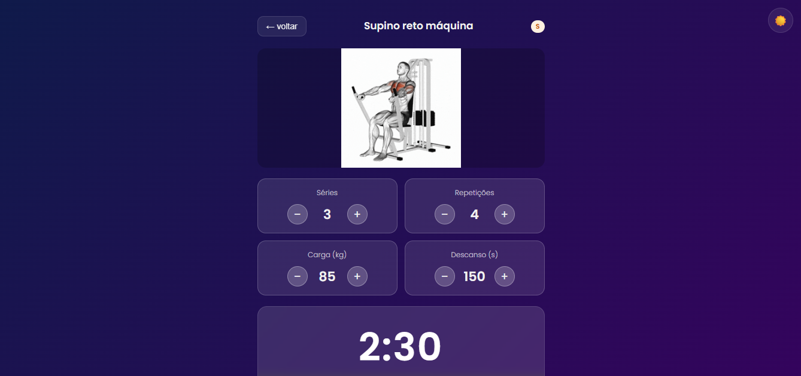
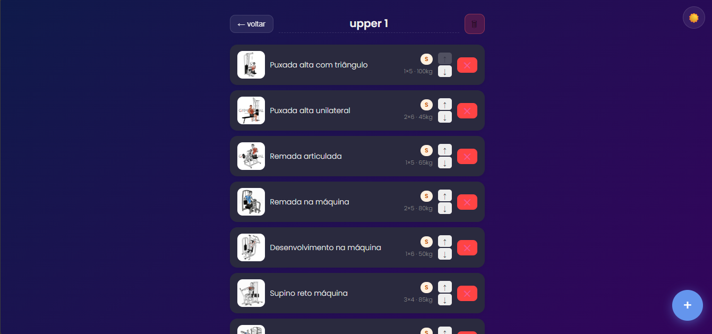
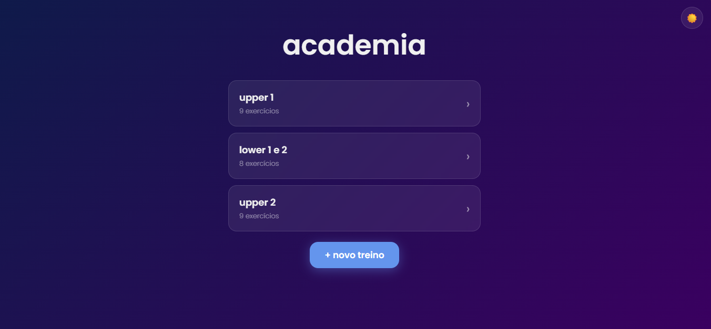

# projeto-gym

 🏋️‍♂️ Gains Academy

Esse projeto é uma aplicação web que fiz para organizar treinos de academia de forma simples e prática, foi meu projeto mais complicado e dificil e o primeiro de todos.

A ideia foi criar algo que eu mesmo usaria no dia a dia, onde dá pra montar treinos, adicionar exercícios e acompanhar tudo durante o treino, tudo de forma extremamente completa.

 O que dá pra fazer

- Criar treinos
- Adicionar e remover exercícios
- Ajustar séries, repetições, carga e tempo de descanso
- Usar um timer pra controlar o descanso
- Escrever notas em cada exercício
- Filtrar exercícios por grupo muscular e nível
- aprender sobre exercicios
- Alternar entre modo claro e escuro
- Os dados ficam salvos no navegador e nunca se perdem

Tecnologias usadas

- HTML
- CSS
- JavaScript (puro)
- LocalStorage

Preview



 
Acessar o projeto

https://bryanfellas.github.io/site-de-academia-bom/

Rodar localmente

```bash
git clone https://github.com/bryanfellas/site-de-academia-bom.git
cd projeto-gym
```

Depois é só abrir o `index.html`.


Fiz esse projeto pra treinar JavaScript e também porque curto academia, então quis juntar as duas coisas.
